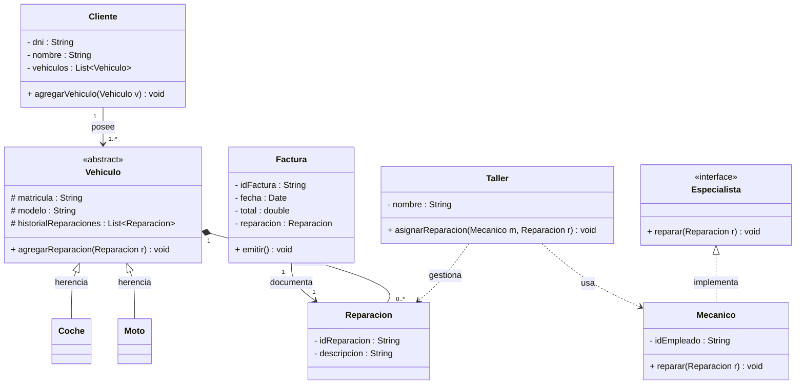

# TALLER MERCEDAWs - MERMAID

## FASE 1:

Este documento presenta el **modelo de dominio y la estructura de clases** para el sistema de gestión del taller mecánico **"MerceDAWs"**. Mediante un diagrama de clases UML, se detallan las entidades principales del sistema (Clientes, Vehículos, Reparaciones, Mecánicos...) junto con sus relaciones estructurales y de comportamiento.

