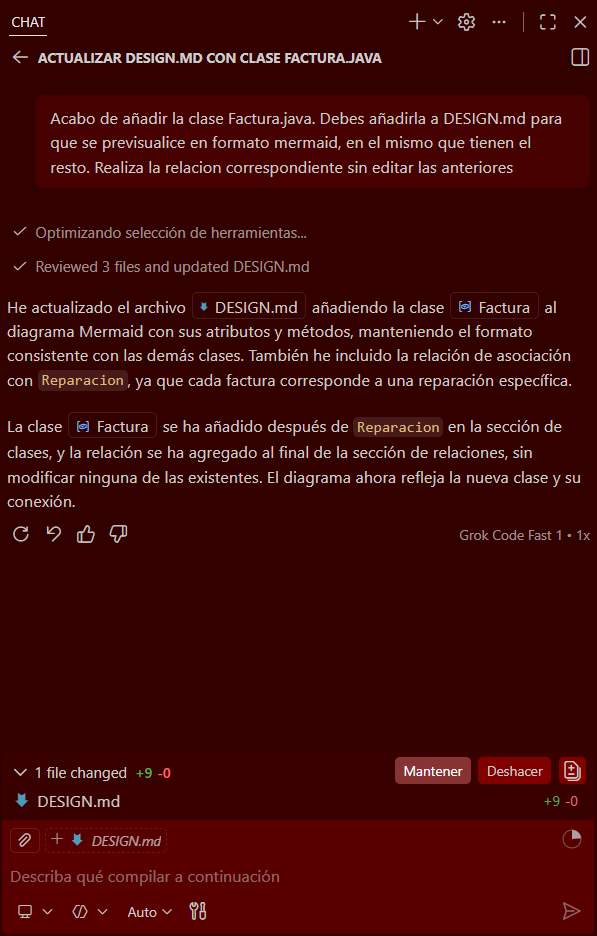

# Taller MerceDAWs - Sistema de Gestión y Fases de Desarrollo

Bienvenido al repositorio de **Taller MerceDAWs**, un proyecto de desarrollo enfocado en la aplicación práctica de la Programación Orientada a Objetos (POO) en Java y los principios de Ingeniería del Software.

Este sistema simula la lógica de negocio y la estructura de datos de un taller mecánico. Permite gestionar de forma eficiente entidades clave como clientes, distintos tipos de vehículos (coches y motos), el historial de reparaciones, el personal especialista y la facturación. 

Más allá del código fuente, el propósito de este repositorio es documentar de forma transparente el **ciclo de vida del desarrollo**. A través de las siguientes fases, se demuestra el flujo de trabajo completo: desde el diseño arquitectónico en diagramas UML (Ingeniería Directa) hasta la actualización de la documentación a partir de código nuevo (Ingeniería Inversa) aplicando buenas prácticas como el desacoplamiento de clases.

A continuación, se detalla la evolución del proyecto dividida en cuatro fases principales.

---

## FASE 1: Modelado Conceptual
El diseño inicial del sistema define la estructura base y las interacciones entre los componentes antes de escribir una sola línea de código.

👉 **[Haz clic AQUÍ para ver el Diagrama de Clases completo](DESIGN.md)**

---

## FASE 2: Ingeniería Directa (UML a Código)
A partir del modelo conceptual y arquitectónico definido en la Fase 1, se ha aplicado el proceso de **Ingeniería Directa** para traducir el diagrama UML a código fuente en Java. 

El objetivo principal ha sido reflejar fielmente el "plano" diseñado para construir el esqueleto estructural del sistema. Se han implementado las siguientes características:

* **Definición de Entidades:** Creación de las clases base (`Cliente`, `Vehiculo`, `Coche`, `Moto`, `Reparacion`, `Mecanico`, `Taller`) y la interfaz `Especialista`.
* **Traducción de Relaciones:**
  * Implementación estricta de herencia y realización.
  * Resolución de multiplicidades de composición y asociación (ej. `1..*`) mediante el uso de Colecciones en Java (`List<Vehiculo>`, `List<Reparacion>`).
* **Encapsulamiento y Firmas:** Respeto riguroso de las visibilidades estipuladas en el diagrama (atributos `private` y métodos `public`).

### Estructura de Clases Implementadas

| Entidad / Interfaz | Archivo Java |
| :--- | :--- |
| **Cliente** | [`Cliente.java`](ActividadTaller/src/main/Cliente.java) |
| **Coche** | [`Coche.java`](ActividadTaller/src/main/Coche.java) |
| **Especialista** | [`Especialista.java`](ActividadTaller/src/main/Especialista.java) |
| **Mecanico** | [`Mecanico.java`](ActividadTaller/src/main/Mecanico.java) |
| **Moto** | [`Moto.java`](ActividadTaller/src/main/Moto.java) |
| **Reparacion** | [`Reparacion.java`](ActividadTaller/src/main/Reparacion.java) |
| **Taller** | [`Taller.java`](ActividadTaller/src/main/Taller.java) |
| **Vehiculo** | [`Vehiculo.java`](ActividadTaller/src/main/Vehiculo.java) |

---

## FASE 3: Decisiones de Diseño Arquitectónico

### 1. ¿Por qué se ha elegido composición entre `Vehiculo` y `Reparacion`?
Se ha optado por una **composición (vínculo fuerte)** en lugar de una agregación porque el ciclo de vida de una reparación está estrictamente ligado al del vehículo. Una reparación no existe de forma autónoma en el sistema del taller ("no tiene sentido sin un vehículo"). Si el vehículo se elimina de la base de datos o se destruye en memoria, su historial de reparaciones debe desaparecer con él.

> **Nota Técnica:** Al tratarse de una aplicación de gestión específica para vehículos, en este entorno una reparación solo tiene sentido si existe dicho vehículo registrado (a diferencia del mundo real, donde el concepto de reparación puede aplicar a otras cosas).

### 2. ¿Qué ventaja tiene usar la interfaz `Especialista`?
El uso de una interfaz fomenta el principio de **Desacoplamiento** y facilita la escalabilidad del sistema. 
Al obligar a la clase `Mecanico` a implementar `Especialista`, el taller está preparado para el futuro. Podría contratar a un `Chapista` o a un `Pintor` que también implementen `Especialista`. Si la clase `Taller` se programa para depender de la interfaz `Especialista` (abstracción) en lugar de la clase concreta `Mecanico`, podrá asignar reparaciones a cualquier tipo de trabajador sin modificar su propio código base.

---

## FASE 4: Ingeniería Inversa (Código a UML)
En esta última fase, se ha invertido el ciclo de vida del desarrollo aplicando el proceso de **Ingeniería Inversa**. El objetivo ha sido obtener la documentación arquitectónica actualizada partiendo de modificaciones realizadas directamente en el código fuente.

1. **Implementación Directa:** Se ha creado la clase `Factura.java` sin un modelado previo. Esta clase incluye atributos propios (`idFactura`, `fecha`, `total`) y una referencia de tipo clase (`private Reparacion reparacion;`).
2. **Generación Automática del UML:** Se ha utilizado una IA como herramienta de análisis estático. Al procesar el código fuente actualizado, la IA ha sido capaz de leer las clases, atributos y colecciones para generar automáticamente el nuevo código Mermaid.
3. **Trazado de la Nueva Relación:** El proceso de ingeniería inversa ha detectado correctamente la nueva estructura y ha trazado una **Asociación Dirigida**: `Factura "1" --> "1" Reparacion : documenta`.

👉 **[Haz clic AQUÍ para ver el Diagrama de Clases con los cambios actualizados por la IA](DESIGN.md)**
